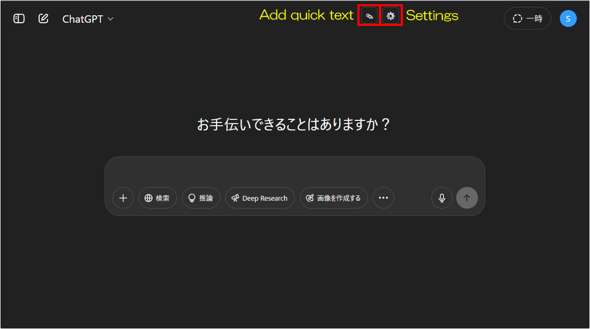
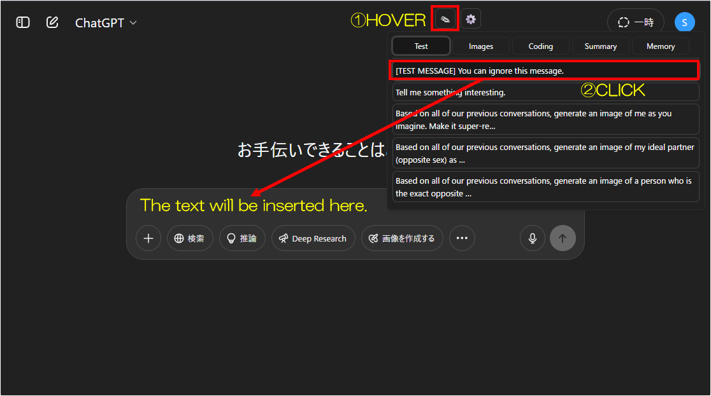
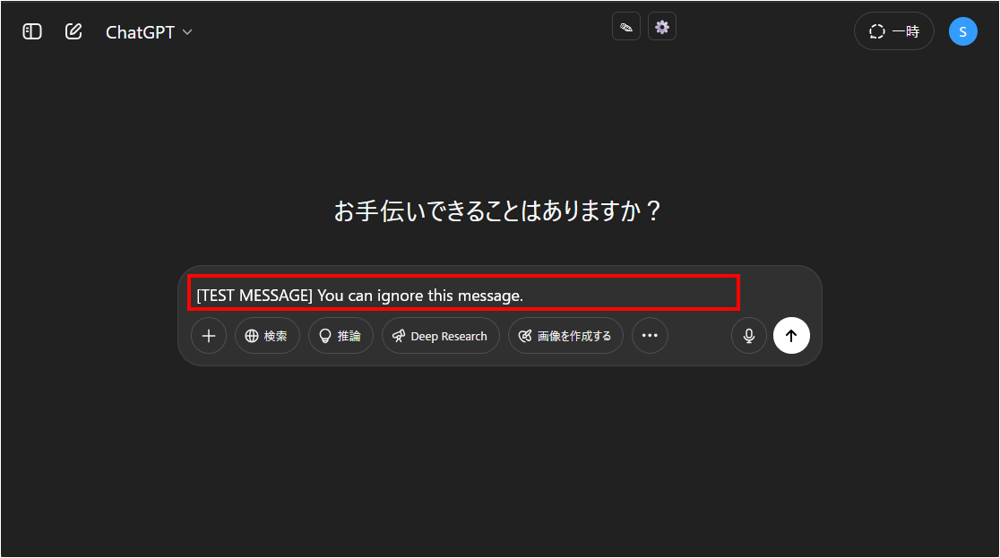
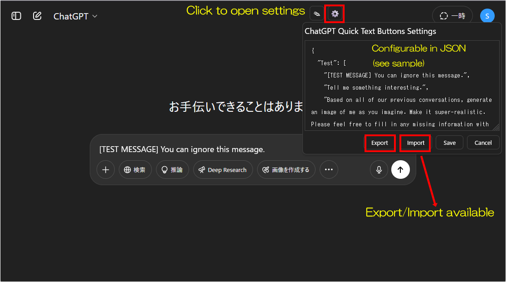

# ChatGPT Quick Text Buttons

[日本語READMEはこちら](./README_ja.md)

---

## Overview

A Tampermonkey userscript that adds **quick text snippet buttons** to the ChatGPT chat interface.

---

## Features

* Instantly insert frequently used text snippets into the ChatGPT input field with a single click
* Multiple sets of snippets by category (tabbed)
* No dependencies (pure JavaScript; does **not** require jQuery)
* Easy customization with bundled sample JSON files (English & Japanese included)

---

## How to Use

### 1. Main Toolbar Buttons

Two icons are added to the top-right corner:
**“Add Quick Text”** (✎) and **“Settings”** (⚙️).



---

### 2. Insert a Quick Text

Hover over the ✎ icon to show a list of registered text snippets.
Click a snippet button to instantly append that text to the chat input field.



---

### 3. Confirm the Insertion

The selected text will be added to the end of the input box.
You can edit or send as usual.



---

### 4. Customize with the Settings Screen

Click the ⚙️ icon to open a settings window where you can edit snippet definitions in JSON format.
Use the sample definitions as a template and customize for your own needs.



---

## Installation

1. Install [Tampermonkey](https://www.tampermonkey.net/) in your browser
2. Download the latest userscript
   [`ChatGPT Quick Text Buttons.user.js`](./ChatGPT%20Quick%20Text%20Buttons.user.js)
3. In Tampermonkey, create a new script and paste in the script contents, or drag & drop the `.user.js` file into Tampermonkey
4. Optionally, use the sample text JSON files as shown below

---

## Updating

1. Open the script in the Tampermonkey dashboard
2. Replace all contents with the latest [`ChatGPT Quick Text Buttons.user.js`](./ChatGPT%20Quick%20Text%20Buttons.user.js)
3. Save (Ctrl+S)

---

## Compatibility

* Tested on Firefox (latest) + Tampermonkey
* Should also work on Chrome, Edge, and other major browsers (not explicitly tested)

---

## Sample Snippet Definitions

Sample snippet files (`sample_texts_en.json` and `sample_texts_ja.json`) are included in the `samples` directory.
Copy & paste contents into the settings window as needed.

The JSON structure is simple—see below for a template.
Refer to the [`samples`](samples) directory for ready-to-use examples.

```json
{
  "Button1": [
    "Sample text 1",
    "Sample text 2"
  ],
  "Button2": [
    "Line 1 of text\nLine 2 of text\nLine 3 of text",
    "Another snippet"
  ],
  "Button3": [
    "If you want to add your own input after a fixed phrase, add a line break at the end.\n\n"
  ]
}
```

---

## Notes

* **There is no auto-update.**
  When a new version is released, please manually replace the script.

---

## License

MIT License

---

## Author

* [p65536](https://github.com/p65536)

---
