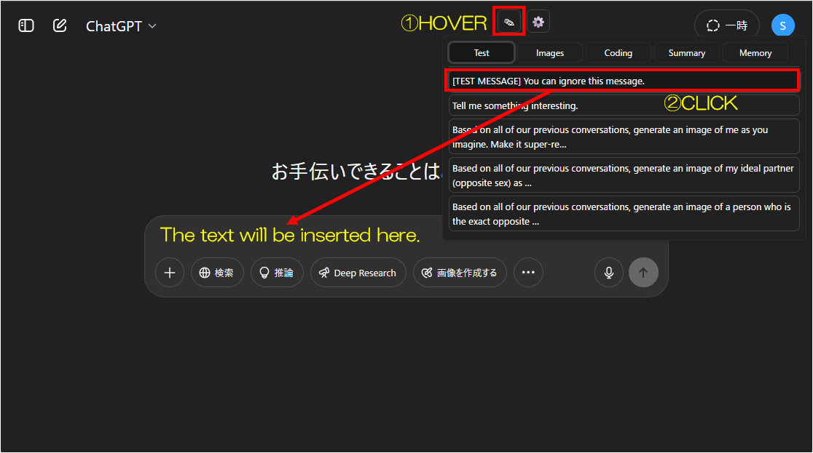

# ChatGPT Quick Text Buttons


[](https://github.com/p65536/ChatGPT-Quick-Text-Buttons/raw/main/ChatGPT%20Quick%20Text%20Buttons.user.js)

  
最終更新日: **2025年5月27日**  
[変更履歴はこちら](./CHANGELOG_ja.md)

[English README is here.](./README.md)

---

## 概要

ChatGPTのチャット画面に「定型文クイック挿入ボタン」を追加する Tampermonkey 用ユーザースクリプトです。

  >### 関連スクリプト
  >**[ChatGPT Project Theme Automator](https://github.com/p65536/ChatGPT-Project-Theme-Automator)**  
  ChatGPTの見た目やテーマをカスタマイズできるスクリプトです。吹き出しの色・形・フォント、背景画像などを自由に変更できます。

---

## 特徴 

* 定型文（テキストスニペット）をワンクリックで入力欄に挿入
* 用途ごとに複数のボタンセットを切り替え可能
* 設定をエクスポート／インポート可能
* サンプル定型文ファイル付属。カスタマイズも簡単（json形式）

---

## 使い方・操作例

### 1. メインツールバーのボタン

画面右上に「クイックテキスト追加」（✎）と「設定」（⚙️）のアイコンが追加されます。


---

### 2. クイックテキストの挿入

✎アイコンにカーソルを重ねると、登録済みテキストのボタン一覧が表示されます。
挿入したいテキストをクリックすると、チャット入力欄に自動で追加されます。



---

### 3. 挿入結果の確認

選択したテキストが入力欄の末尾に追加されます。
あとは通常通り送信してください。


---

### 4. 設定画面でカスタマイズ

⚙️アイコンをクリックすると、ボタンに登録するテキストをJSON形式で自由に編集できます。
サンプル定義を参考にして、ご自身の用途に合わせてカスタマイズしてください。  
インポート／エクスポートもここで実行できます。


---

## インストール方法

1. [Tampermonkey 拡張](https://www.tampermonkey.net/) をお使いのブラウザにインストール
2. このリポジトリの最新版スクリプト
   [`ChatGPT Quick Text Buttons.user.js`](./ChatGPT%20Quick%20Text%20Buttons.user.js) をダウンロード
3. Tampermonkey のダッシュボードで「新規スクリプト作成」→ スクリプト内容を貼り付けて保存
   または `.user.js` ファイルを Tampermonkey にドラッグ＆ドロップ
4. 必要に応じてサンプル定型文ファイル（後述）も利用可能

---

## 更新方法

念のため、設定はエクスポートしておいてください。

1. Tampermonkey のダッシュボードから本スクリプトを開く
2. 最新版 [`ChatGPT Quick Text Buttons.user.js`](./ChatGPT%20Quick%20Text%20Buttons.user.js) の内容で全文置換
3. スクリプトを保存 (Ctrl+S)

---

## 動作確認環境

* Firefox（最新版）＋Tampermonkeyで動作確認済み
* Chrome, Edge などの主要ブラウザでも同様に動作するはずです（未検証）

---

## サンプル定型文

`samples` フォルダに日本語・英語のサンプル定型文ファイルを用意しています（`sample_texts_ja.json`, `sample_texts_en.json`）。
必要に応じて設定画面で内容をコピペして利用してください。

jsonの基本構造は以下の通りです。
実際に使えるサンプル例は [`samples`](./samples) ディレクトリを参照してください。

```json
{
  "Button1": [
    "Sample text 1",
    "Sample text 2"
  ],
  "Button2": [
    "Line 1 of text\nLine 2 of text\nLine 3 of text",
    "Another snippet"
  ],
  "Button3": [
    "If you want to add your own input after a fixed phrase, add a line break at the end.\n\n"
  ]
}
```

---

## 注意事項

* スクリプト自体に自動アップデート機能はありませんが、[Greasy Fork](https://greasyfork.org/ja/scripts/537694-chatgpt-quick-text-buttons) でもスクリプトを公開しています。  
  スクリプトを自動更新したい方は、 Greasy Fork からインストールしてください。  
  スクリプトを手動更新したい方は、手動でスクリプトを差し替えてください。  

---

## 変更履歴

変更内容の詳細については [`CHANGELOG_ja.md`](./CHANGELOG_ja.md) を参照してください。

---

## ライセンス

MIT License

---

## 作者

* [p65536](https://github.com/p65536)

---

## 既知の問題

* 設定モーダルが一部のブラウザ環境で想定外の挙動をすることがある  
  ↳ 暫定対処済み。


## 今後の予定

### 優先的に検討中の項目（作者が実装したいと考えている）

* カテゴリ数増加に備えて、現在のタブ型のほかにリスト形式も設定可能とする。タブ数が少ない場合はタブ型のほうが選択しやすいため、どちらの設定にするかはユーザーが選択可能とする。
* カテゴリ内のテキスト数増加に備えて、スクロール対応（今は画面の高さを超えると、はみ出たテキストを選択できない。自分は1カテゴリ5テキストくらいで使っているから実害はないが……）

### 検討はしているが、現状では必要性を感じていない項目

* 設定画面のGUI化（JSON編集でよくね？）
* クラウド経由での設定同期（export/importによるローカル管理で十分）
* テキストボタンの並び順をドラッグで変更できる機能（JSON編集でよくね？）
* テキスト挿入位置をカーソル位置にする（うーん……）
* クリップボードの内容を自動展開する（自分では使わないと思う）
