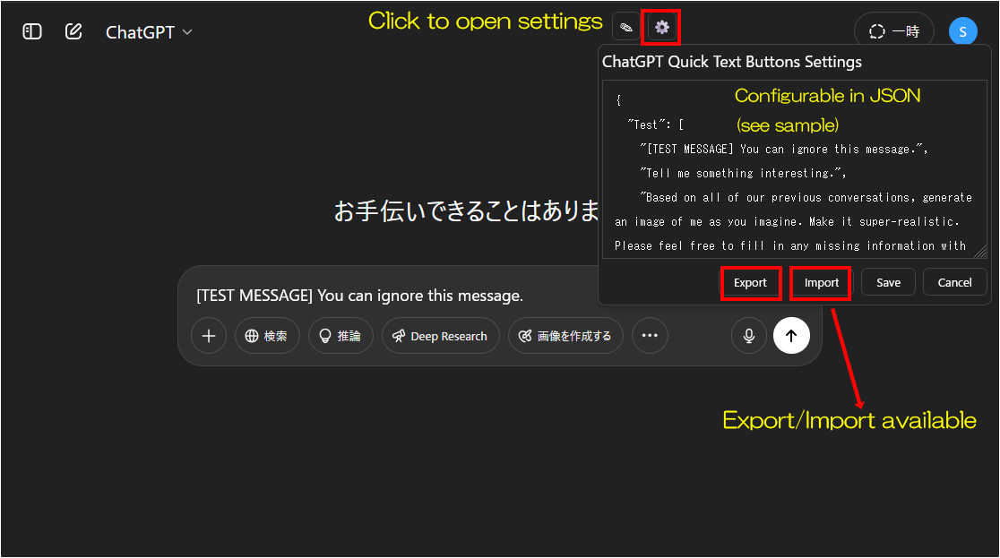

# ChatGPT Quick Text Buttons


[](https://github.com/p65536/ChatGPT-Quick-Text-Buttons/raw/main/ChatGPT%20Quick%20Text%20Buttons.user.js)

  
Last updated: **2025/07/05**  
[View changelog](./CHANGELOG.md)

[日本語READMEはこちら](./README_ja.md)

---

## Overview

A Tampermonkey userscript that adds **quick text snippet buttons** to the ChatGPT chat interface.

  >### Related Script  
  >**[ChatGPT Project Theme Automator](https://github.com/p65536/ChatGPT-Project-Theme-Automator)**  
  >A userscript that allows you to customize the appearance and theme of ChatGPT, including bubble colors, shapes, fonts, and background images.

---

## Features

* Instantly insert frequently used text snippets into the ChatGPT input field with a single click
* Multiple sets of snippets by category (tabbed)
* Settings can be exported/imported
* Easy customization with bundled sample JSON files (English & Japanese included)

---

## How to Use

### 1. Main Toolbar Buttons

Two icons are added to the top-right corner:
**“Add Quick Text”** (✎) and **“Settings”** (⚙️).


---

### 2. Insert a Quick Text

Hover over the ✎ icon to show a list of registered text snippets.
Click a snippet button to instantly append that text to the chat input field.


---

### 3. Confirm the Insertion

The selected text will be added to the end of the input box.
You can edit or send as usual.


---

### 4. Customize with the Settings Screen

Click the ⚙️ icon to open a settings window where you can edit snippet definitions in JSON format.
Use the sample definitions as a template and customize for your own needs.  
You can import/export here.



---

## Installation

1. Install [Tampermonkey](https://www.tampermonkey.net/) in your browser
2. Download the latest userscript
   [`ChatGPT Quick Text Buttons.user.js`](./ChatGPT%20Quick%20Text%20Buttons.user.js)
3. In Tampermonkey, create a new script and paste in the script contents, or drag & drop the `.user.js` file into Tampermonkey
4. Optionally, use the sample text JSON files as shown below

---

## How to update

**Before updating, export your settings. (Just to be safe)**

1. Open the script in the Tampermonkey dashboard
2. Replace all contents with the latest [`ChatGPT Quick Text Buttons.user.js`](./ChatGPT%20Quick%20Text%20Buttons.user.js)
3. Save (Ctrl+S)

---

## Compatibility

* Tested on Firefox (latest) + Tampermonkey
* Should also work on Chrome, Edge, and other major browsers (not explicitly tested)

---

## Sample Snippet Definitions

Sample snippet files (`sample_texts_en.json` and `sample_texts_ja.json`) are included in the `samples` directory.
Copy & paste contents into the settings window as needed.

The JSON structure is simple—see below for a template.
Refer to the [`samples`](./samples) directory for ready-to-use examples.

```json
{
  "Button1": [
    "Sample text 1",
    "Sample text 2"
  ],
  "Button2": [
    "Line 1 of text\nLine 2 of text\nLine 3 of text",
    "Another snippet"
  ],
  "Button3": [
    "If you want to add your own input after a fixed phrase, add a line break at the end.\n\n"
  ]
}
```

---

## Notes

* This script does not include a built-in auto-update mechanism. However, it is also published on [Greasy Fork](https://greasyfork.org/ja/scripts/537694-chatgpt-quick-text-buttons).  
  If you want the script to update automatically, please install it from Greasy Fork.  
  If you prefer to manage updates manually, simply replace the script file yourself when a new version is released.

---

## Changelog

For detailed information about the changes, please see [`CHANGELOG.md`](./CHANGELOG.md).

---

## License

MIT License

---

## Author

* [p65536](https://github.com/p65536)

---

## Known Issues

* The settings modal may behave unexpectedly in certain browser environments  
  → A temporary fix has been applied.

---

## Future Plans

### Planned Features

* Add an option to switch from the current tab-based layout to a list-style layout, to accommodate a larger number of categories.  
  → Tabs are easier to navigate when categories are few, so users will be able to choose their preferred layout.
* Add scroll support within each category when the number of texts exceeds the viewport height.  
  → Currently, overflowing texts become inaccessible. Personally, I only use around 5 texts per category, so it's not been an issue yet.

### Ideas Under Consideration (not planned)

* GUI-based settings editor (Honestly, editing JSON is good enough.)
* Cloud-based setting sync (Local management via export/import works fine.)
* Drag-and-drop to reorder buttons (Again, JSON editing suffices.)
* Insert text at the cursor position instead of the end (Hmm... undecided.)
* Automatically expand clipboard contents (I probably wouldn't use this myself.)
